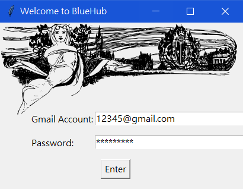

# BlueHub_GUI
NCKU course crawler.

## Features
* Search the course information.
* Schedule the searching list.
* Send email to notify the user when the course is not full.

## Version
### **`2.0`**
Afer the NCKU course web had been upgrated, the original version of BlueHub couldn't work any more. I tried to use basic get/post methods to get the information of web, but it's difficult because the form-data was encrypted. So I use [**selenium**](https://www.selenium.dev/documentation/en/)--- a slower, but more powerful tool to get what I want. It probably takes 10 seconds to obtain the html of web.

## Demo
* Logging picture

(cover picture refers from [openclipart.org](https://openclipart.org/image/400px/svg_to_png/319171/ladybookandglobe-1901.png))

* Menu

## Future
* Use line-bot or messenger-bot to take the place of email.
* Beautify GUI.

## Declaration
* This project is **only for learning purpose**.
* Documents specified above follow the rules of separate authorization regulations.
